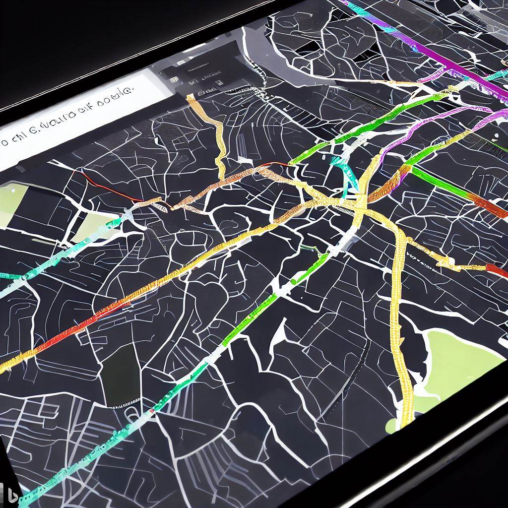

# LTSBikePlan
Level of Traffic Stress Bike Planning and Infrastructure Network Analysis for Safe and Accessible Cycling

The final document is [here]().
The final presentation is 

## Topic

LTSBikePlan is an analysis tool aimed to identify safe and accessible cycling by developing a planning for bicycle infrastructure that takes into account the level of traffic stress from different data sources.

The starting infrastructural data are those of OpenStreetMap, to which are then added information data on the real use of the roads by cyclists, pedestrians and cars. Then other open data on connectivity measure will be taken into account for use cases.

- [LTSBikePlan](#ltsbikeplan)
  - [Topic](#topic)
    - [Basic idea](#basic-idea)
    - [Products](#products)
    - [Test LTSBikePlan for cities in Italy.](#test-ltsbikeplan-for-cities-in-italy)
        - [How to use it?](#how-to-use-it)
        - [Data](#data)
        - [Example cities](#example-cities)
    - [Tasks](#tasks)
  

### Basic idea

Adapt the [Furth, Mekuria et al. work on LTS](https://scholarworks.sjsu.edu/mti_publications/74/), validate it to compute bike network connectivity in Italian road network taking into account other variables such as slope gradient and other connectivity measures for different use cases.
 
My thesis proposal can be accessed [here](https://github.com/DigitalCommonsLab/LTSBikePlan/blob/main/docs/Index%20%26%20Thesis%20documents/thesis_proposal.html). Keep in mind, it will be periodically updated.	

### Products

1. [Test LTSBikePlan for cities in Italy]().
 
2. A [series of scripts](https://github.com/DigitalCommonsLab/LTSBikePlan/tree/main/code) that come together into an [Markdown report](). 

### Test LTSBikePlan for cities in Italy. 

##### How to use it?

1. Clone this repository. 
2. Edit the main.py file with your study area, and run the Python files locally to obtain the results.
3. Wait for a while, keep in mind larger areas take longer.
4. Check out your results as an HTML file. 

##### Data

The LTSBikePlan bases its methodology on [OSM](https://www.openstreetmap.org/) data and on [Tinitaly](https://tinitaly.pi.ingv.it/) DEM data (DTM), however other data is accessed from other data sources. Particularly for this project, this other datasets were used:

- Italy:
  - (...)
  - (...)
  

##### Example cities

### Tasks

- [ ] Translate [Furth, Mekuria et al. work on LTS](https://scholarworks.sjsu.edu/mti_publications/74/) scripts into Python, R, JS and SQL architecture.
- [X] Validate the level of traffic stress classification using slope.
- [ ] Validate the tool with different cities (Udine, Bologna etc.) by including measures on the flow and network analysis to address bikeability.
- [ ] Allowing the possibility to integrate other data (e.g. from P.A.) in the models.
- [ ] Create a report of the results that will highlight possible solutions for tactical urbanism strategies in critical areas.
- [ ] Create a webapp for the Italian road network
- [ ] \(Optional) Create a web app to show the computed results and other statistics

