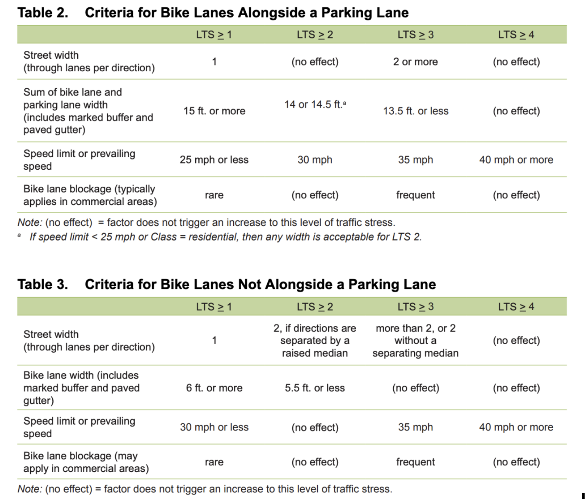
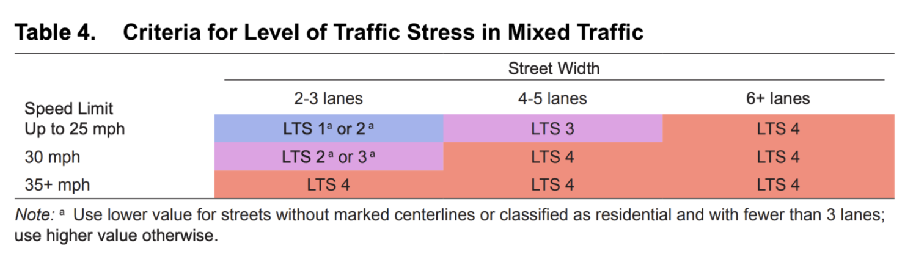
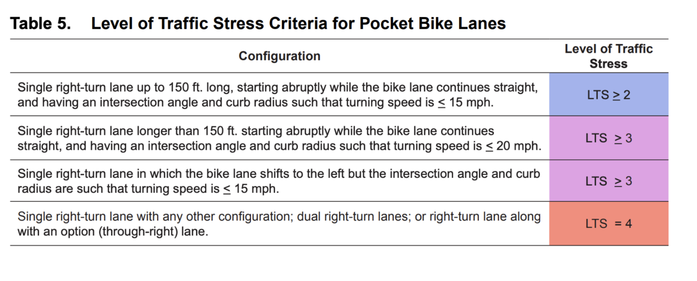
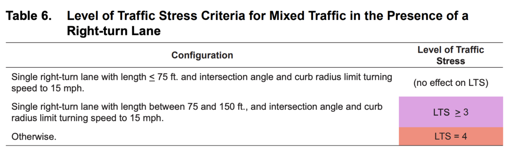
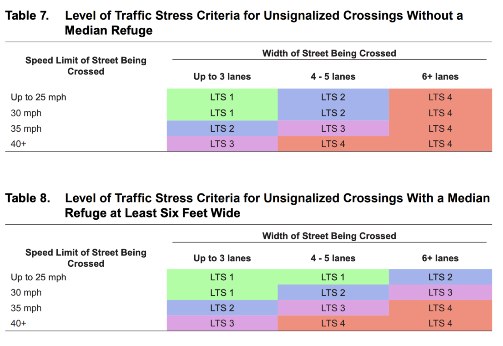
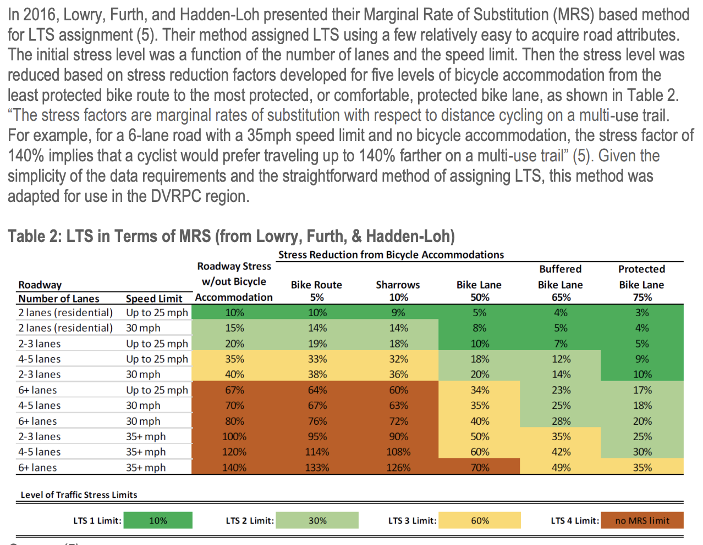
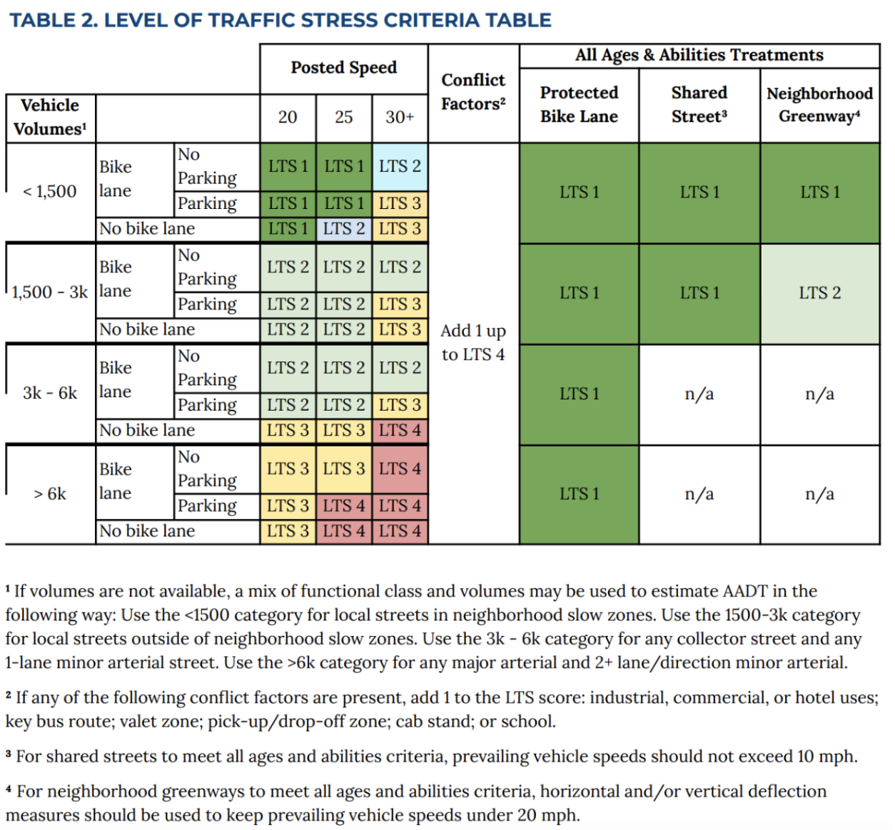
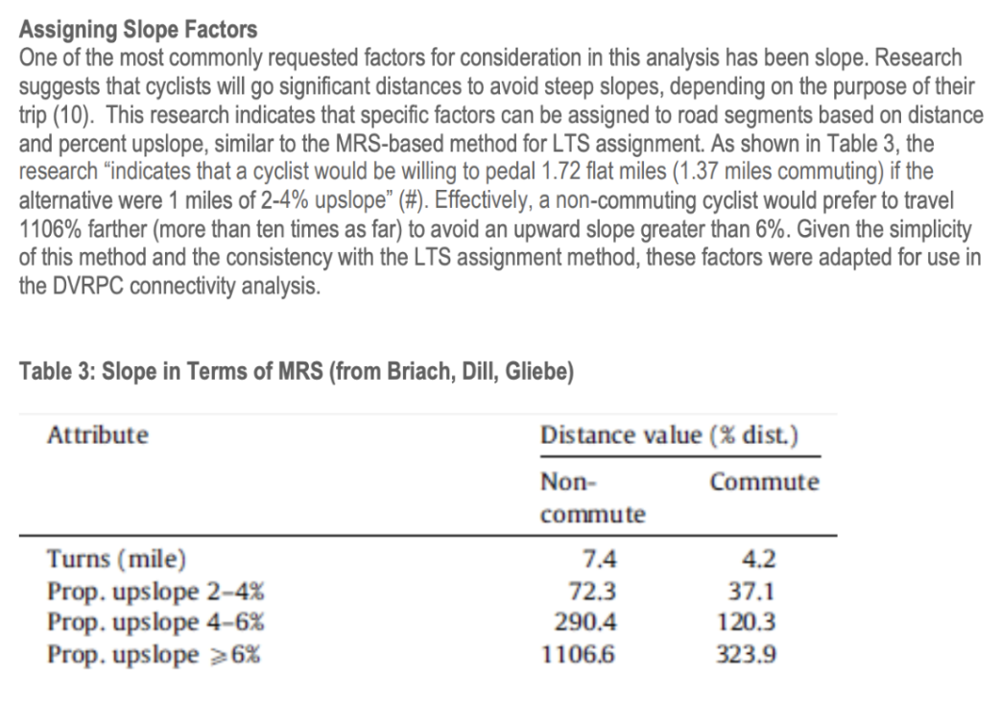
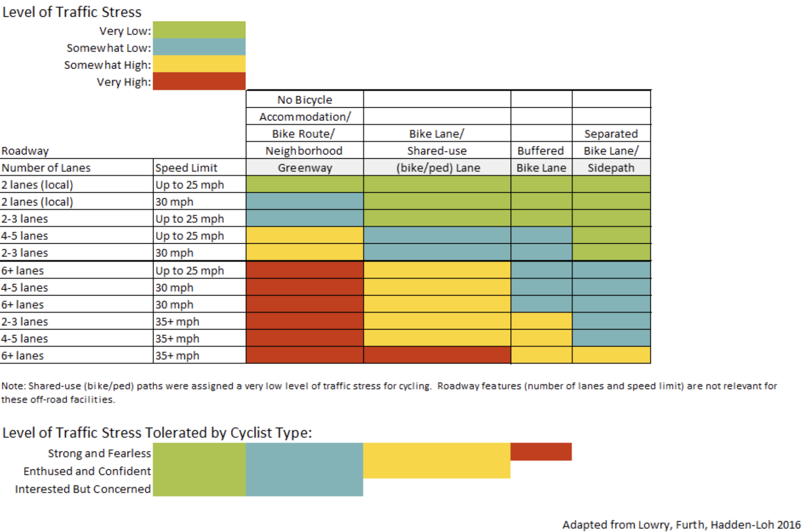

The work is structured in this way: in the initial phase, a generic overview related to the state of the art on bicycle mobility improvement plans is presented. Then the methods are divided in three categories. For each category a list of papers/works has been analyzed to highlight the required aspects, strenghts and weaknessess. Finally, we can find a summary list of the references taken into consideration.

General introduction:

Improvement plans for cycling conditions can be categorized into demand-driven and supply-driven approaches.

*Demand-driven planning methods* rely on current/potential travel behavior, primarily by examining and quantifying the movement of cyclists between different areas (B. W. Landis, 1996; Rybarczyk & Wu, 2010; Schwartz et al., 1999; Turner, Hottenstein, & Shunk, 1997). These techniques help pinpoint enhancements that will serve the largest number of cyclists by emphasizing demand over roadway conditions. However, they fail to determine the specific improvements needed at particular locations (Hyodo, Suzuki, & Takahashi, 2000; Porter, Suhrbier, & Schwartz, 1999; Schwartz et al., 1999). Furthermore, demand is not static and likely depends on the conditions encountered by cyclists. Several studies suggest that cyclists' route choices are influenced by the stress levels they experience on the road network (Furth et al., 2016; Geller, 2011; B. W. Landis, 1996). 

On the other hand, *supply-driven planning methods* concentrate on evaluating the existing road network conditions for cyclists and typically prioritize upgrades in the worst areas, leading to the establishment of protected infrastructure along all major arteries and collector roads (Harkey, Reinfurt, & Knuiman, 1998; B. W. Landis, 1996; Rybarczyk & Wu, 2010). Among supply-driven models, the **LTS indicator** has gained prominence due to its straightforward calculation and easily accessible data. While supply-driven planning approaches vary in their indicator calculation methods, they all recognize a range of factors that can impact cyclists. Based on the variables considered, supply-driven approaches can be grouped into three primary categories, focusing on: **(a) road and traffic conditions, (b) perceived factors, and (c) physiological factors.** Methodologies focusing on road and traffic conditions categorize road segments (and occasionally intersections) into distinct groups based on chosen variables with similar attributes. The *Davis Bicycle Safety Index* (Davis, 1987) was among the earliest systematic efforts to assess roads' operational conditions for cyclists. It computes the *Roadway Segment Index (RSI)* and *Intersection Evaluation Index (IEI)* to create the *Bicycle Safety Index Rating (BSIR)*, founded on relatively simple-to-measure road attributes. Sorton and Walsh (1994) pioneered the emphasis on "stress," developing the *Bicycle Stress Level (BSL)* that classifies road segments into one of five stress levels. Landis (1996) formulated the *Interaction Hazard Score (IHS)*, which delineates six levels of service categories employing existing road and traffic variables. **LTS**, introduced by Mekuria et al. (2012), defines four traffic stress categories based on road characteristics' threshold criteria, with the lowest performing criterion determining classification. Lowry et al. (2016) computed bicycle stress using *Marginal Rates of Substitution (MRS)* for every road segment concerning stress-inducing and stress-mitigating factors. Generally, methodologies centered on road and traffic conditions employ accurate and readily available data. However, many of these methods utilize subjective non-statistically calibrated decision criteria (B. Landis, Vattikuti, & Brannick, 1997). On the other hand, perceived factors-based methodologies utilize surveys and real-time cyclist perceptions to pinpoint various road metrics, such as stress generated, level of service, or latent demand (in demand-based models). These perceptions are then correlated to specific variables present in each road. Sorton and Walsh (1994) validated their BSL with a group of cyclists who rated segments based on traffic conditions captured on videos. Landis et al. (1997) introduced the *Bicycle Level of Service (BLOS)* to account for a statistically calibrated model that describes a road's service level. It employs a mathematical function of human perception of stimuli, derived from observations of a large cyclist group, thus identifying stress factors and translating them into an index divided into six stress categories. Following a similar approach, Harkey et al. (1998) developed the *Bicycle Compatibility Index (BCI)*. They presented videos of varying segments to a cyclist group and asked how comfortable they would feel under those operational conditions. Winters et al. (2013) introduced the *Bikeability Index*, a mathematical formula that characterizes bikeability based on a survey, travel behavior studies, and focus groups. Moreover, Blanc and Figliozzi (2016) describe cyclists' comfort levels as a function of bicycle infrastructure using an ordinal logistic regression model. Methodologies in this category link qualitative data on perceived factors to road characteristics through statistical models. However, input data often necessitate extensive surveys with diverse focus groups.
Lastly, physiological factors-based methodologies employ technology to measure biological responses to conditions experienced by cyclists. Caviedes and Figliozzi (2018) based their methodology on on-road measurements of physiological stress using cyclists' *Galvanic Skin Response (GSR)* when exposed to varying traffic conditions. This methodology enables physiological stress measurement on a predetermined route. Berger and Dörrzapf (2018) employed a similar approach, utilizing biophysiological sensors and empirical data to measure stress on a predetermined route. However, physiological approaches can only identify conditions affecting cycling stress along the specific route measured, and it is not guaranteed that these relationships apply in other environments, particularly where road conditions or social norms differ significantly. Moreover, employing these approaches to calculate a bikeability index for an entire urban area to support planning policies may be time-consuming and resource-intensive. Moreover, the methodologies mentioned were devised in locations with distinct characteristics that influenced the decision criteria for stress or bikeability classifications (Geller, 2006; Mekuria et al., 2012; Winters et al., 2013). Adaptations of these methodologies have been executed for other cities with analogous contexts (Caviedes & Figliozzi, 2018; Duthie, Unnikrishnan, & Asce, 2014; Krenn et al., 2015; Mueller & Hunter-Zaworski, 2014; Murphy & Owen, 2019; Rybarczyk & Wu, 2010). To be more precise, the majority of LTS implementations in the literature have been adjusted to accommodate the specific characteristics of their originating locations. We can say that they were locally specified and focused. An example is the work of Lowry et al. (2016), which adapted the original LTS to align with Seattle' particular traits. Montgomery County Planning Department (2018) altered the initial LTS classification and introduced LTS 0, LTS 2.5, and LTS 5 categories to suit Montgomery County, Maryland's specific requirements. Other alternatives were proposed by Oregon Department of Transportation (2017) in Oregon and Berkeley City Council (2017) in Berkeley (US). These context-specific modifications are designed to match the characteristics of the cities in which they were applied; therefore, these modifications may not be applicable to other cities with differing economic, social, and cultural contexts.
Conversely, other LTS implementations have been developed to overcome place-specificity and generate a more generalized LTS. Furth (2017) sought to enhance the LTS's generalizability by creating a second version, employing only six of the original 21 variables. Conveyal (2015) presented an extreme simplification of the traditional LTS, termed "Surrogate LTS," utilizing only four variables derived from a few OpenStreetMap (OSM) tags. However, these general LTS implementations use very few variables that scarcely capture stress factors in multiple road networks across various contexts. Moreover, none of these LTS implementations, whether general or place-specific, consistently produce the same LTS classification. In contrast to the original LTS conception, some variables employed in the aforementioned methodologies may not be readily available or easily calculated. However, a small set of relevant variables commonly used in previous methodologies are widely accessible in many countries, including road width, number of lanes, presence of cycling infrastructure, presence of heavy vehicles, traffic speed, and traffic volume. Methodologies centered on perceived stress link cyclists' real-world observations with road attributes through robust statistical models, but they often require data that is hard or expensive to obtain. Meanwhile, methodologies focused on physiological stress effectively connect cycling conditions to actual stress experienced, but they can be costly and challenging to apply. These methodologies were developed in urban settings reflecting location-specific traits, which may not necessarily apply to other cities.
The proliferation of LTS adaptations addressing both place-specificity and generality requirements leads to varying LTS classifications across the same road networks. 

Articles analyzed divided in the three categories of supply-driven approaches:

**a - Road and traffic conditions**

Title: **Low-Stress Bicycling and Network Connectivity**

Authors: Maaza C. Mekuria, Peter G. Furth, Hilary Nixon (Mineta Transportation Institute - 2012)

Description: This research report examines the concept of low-stress bicycling network connectivity, emphasizing the importance of creating connected networks for cyclists to improve safety, accessibility, and ridership. The authors argue that the degree of connectivity of low-stress bicycle networks has a significant impact on the number of people who choose to ride bicycles for transportation. LTS methodology focuses on specific criteria for evaluating traffic stress on road segments, intersection approaches and unsignalized crossings. Specifically, for segments (number of traffic lanes, speed limit, frequency of on-street parking turnover, presence of bikeway facility), for intersection (presence of right turn lane, length of right turn lane, turn lane configuration) and for unsignalized crossing (width of cross street, speed limit, presence or absence of median refuge). Then, the analysis applies a "weakest link" logic, wherein the stress level is assigned based on the lowest-performing attribute of the street.

Key Findings: 

1. Low-stress streets, which are comfortable for most riders, can be classified into four categories: L1 (lowest stress), L2, L3, and L4 (highest stress). The study focuses on creating connected networks of L1 and L2 streets. 
2. The study reveals that the majority of current bicycle networks in the United States consist of disconnected segments and high-stress links, which discourages many people from cycling. 
3. The authors propose a method to assess network connectivity based on five dimensions: directness, coherence, route complexity, safety, and comfort. 
4. The study demonstrates that improving low-stress network connectivity can lead to a considerable increase in the number of people who choose to bicycle for transportation.
5. It also highlights the importance of addressing gaps and barriers in the existing bicycle network to ensure continuous and low-stress routes for cyclists. 
6. Recommendations for improving low-stress network connectivity include investing in infrastructure, prioritizing low-stress routes, integrating with public transit, and considering the needs of all potential users.
* Interesting aspects emerged:
1. Islands of connectivity: sets of links connected to one another but not connected to the rest of the network. The study found that low-stress links or "connectivity clusters" are of limited use for bicycle transportation if they lack low-stress interconnecting links. The study identified three types of barriers that separate low-stress clusters from one another: natural and manmade barriers created by freeways, railroads, and creeks that require grade-separated crossings; arterial streets; and breaks in the residential street grid. The study highlights the importance of low-stress, grade-separated crossings of barriers in enhancing connectivity. 
2. TAZ and Census blocks: Traffic Analysis Zones (TAZs) vary in size according to population density and are usually treated as if demand is concentrated at their centroid. However, the critical issue with zone size for bicycling is not differences in distance or travel time but differences in connectivity. TAZs with incomplete street grids or barriers may only have some points accessible to the bicycling network via low-stress links. The study suggests that land parcels (individual buildings) may be a better unit of demand for analyzing transit service, while TAZs are more appropriate for analyzing travel by automobile. The study proposes using Census blocks as the geographical unit of demand for analyzing bicycle connectivity. Census blocks typically match the common understanding of a city block and have several vertices on their perimeter, which are assumed to be connected to the network if any vertex in or around a block is connected to the network. In shortest-path analysis with blocks as units of demand, each block is represented by a centroid, with connectors between it and the vertices on the perimeter of the block. This compromise between using land parcels and TAZs allows for more accurate bicycle connectivity analysis at a citywide or regional level.
3. Regarding Network Connectivity: a new measure of connectivity has been proposed for evaluating the effectiveness of a bicycling network. The measure is expressed as a percentage of trips that are connected without exceeding a given level of traffic stress and without undue detour. The measure can be calculated using a trip table and a network analysis with block centroids or by looking only at the connectivity between vertex pairs or node pairs in the street and path network. The paper suggests limiting the measure of connectivity to trips in a distance range appropriate to bicycling, such as 4, 6, or 8 miles, to emphasize the bike network's potential to shift trips of moderate length to bicycling. The definition maintains fairness in comparisons between different levels of traffic stress.

URL/DOI: [https://transweb.sjsu.edu/research/Low-Stress-Bicycling-and-Network-Connectivity](https://transweb.sjsu.edu/research/Low-Stress-Bicycling-and-Network-Connectivity)

[https://transweb.sjsu.edu/sites/default/files/1005-low-stress-bicycling-network-connectivity.pdf](https://transweb.sjsu.edu/sites/default/files/1005-low-stress-bicycling-network-connectivity.pdf)

Best ideas identified: 

Here a summary of the useful metrics used to assess the overall connectivity of a bicycle network and how were obtained:

1. Directness:
    * Measure the shortest path between origin and destination using the existing network.
    * Calculate the ratio of the shortest path distance on the bicycle network to the direct distance (as-the-crow-flies) between the origin and destination. A ratio closer to 1 indicates better directness.
2. Coherence
    * Assess the continuity of bicycle facilities (e.g., dedicated lanes, shared lanes) throughout the network.
    * Identify the number of gaps or missing links in the network.
    * Determine the frequency of route changes and transitions between different types of bicycle facilities.
    * Calculate the connectivity index, which can be the ratio of the number of available routes to the total possible routes between various origin-destination pairs.
3. Route complexity
    * Count the number of turns and intersections a cyclist must navigate along a given route.
    * Analyze the presence of decision points and complexity of junctions.
    * Develop a complexity score based on the combination of these factors, with lower scores indicating simpler routes.
4. Safety
    * Evaluate the presence and quality of dedicated bike lanes, traffic calming measures, and intersection designs (e.g., bike boxes, protected intersections).
    * Analyze traffic volume and speed data to assess the level of exposure to motorized traffic.
    * Calculate crash rates or collision risk for cyclists using available accident data.
    * Develop a safety score based on these factors, with higher scores indicating safer routes.
5. Comfort
    * Assess pavement quality and surface conditions along the routes.
    * Evaluate the width of bike lanes and the degree of separation from motorized traffic (e.g., physical barriers, buffer zones).
    * Consider factors such as noise, air pollution, and the presence of shade or greenery along routes.

Main data sources: data on each street segment including its geographical coordinates, curb-to-curb width, number of lanes, width of median, speed limit, and functional class (residential, arterial, freeway): database indicating which intersections have traffic signals; map of bike and pedestrian facilities that includes standalone trails and small links for non-motorized traffic – such as footbridges over freeways – and shows the location of bike lanes and data on bike-lane width obtained from field measurements on streets with bike lanes.

– Traffic Stress criteria for intersection approaches

– Traffic Stress criteria for crossing

Title: North Avenue Corridor Study (LTS Analysis)

Authors: Chittenden County RPC - Communities Planning Together

Description: The document provides guidelines for assigning LTS scores to various road segments, the core of the study was to study a specific area called "North Avenue Corridor Study" in order to provide useful ideas for make the transportation more comfortable in a medium-long term period. It discusses the importance of considering roadway characteristics such as posted speed limits, the number of travel lanes, and the presence of bike lanes. It also highlights the importance of connectivity and addressing the needs of the "Interested but Concerned" cyclists who prefer low-stress routes. The scoring followed the original schema, with no specific changes.

URL/DOI: [https://www.ccrpcvt.org/our-work/transportation/current-projects/corridors-circulation/north-avenue-corridor-study/] (https://www.ccrpcvt.org/our-work/transportation/current-projects/corridors-circulation/north-avenue-corridor-study/)

[https://www.ccrpcvt.org/wp-content/uploads/2016/01/20140611_Level_of_Traffic_Stress_Evaluation_Methodology.pdf](https://www.ccrpcvt.org/wp-content/uploads/2016/01/20140611_Level_of_Traffic_Stress_Evaluation_Methodology.pdf)

Best idea identified: The study highlights pros and cons of the original methodology. Specifically, the authors said that it provides a clear relationship between LTS ratings and user tolerance; establishes a minimum level of service required to serve the mainstream population; doesn’t require traffic volume (except for mixed-traffic roundabout scenario) or lane width data and in general it's an intuitive, easy to understand approach that is transparent and can be easily communicated to
the public. The biggest concern is related to its inability to account for stressor of different kind such as: steep hills, pavement-quality, crime-danger, noise, aesthetics of the surroundings, and absence of lighting or snow removal. This analysis is useful because it can be used for future adaptation of the methodology.

Title: **Prioritizing new bicycle facilities to improve low-stress network connectivity**

Authors: Michael B. Lowry, Peter Furth, Tracy Hadden-Loh (2016)

Description: This paper presents a new approach to prioritize bicycle improvement projects based on the accessibility of key destinations (e.g restaurants, grocery stores ec.). The method utilizes a novel approach to classify "bicycling stress" by using marginal rates of substitution derived from empirical behavioral research on cyclist route selection. MRS values, which factor in the number of lanes and speed limit of a street, serve as input parameters. The approach was programmed as a geographic information system tool and uses commonly available data. The tool was then applied to three improvement scenarios proposed for Seattle with various bike lanes, protected bike lanes, and multi-use trails. The tool generates priority rankings based on a project's capacity to enhance low-stress connectivity between homes and vital destinations. The analysis pinpoints specific neighborhoods and areas that are expected to have greater bikeability. 

URL/DOI: [http://www1.coe.neu.edu/~pfurth/Furth%20papers/2016%20Prioritizing%20to%20improve%20low-stress%20network%20connectivity%20Lowry,%20Furth,%20Hadden-Loh.pdf](http://www1.coe.neu.edu/~pfurth/Furth%20papers/2016%20Prioritizing%20to%20improve%20low-stress%20network%20connectivity%20Lowry,%20Furth,%20Hadden-Loh.pdf)

Best idea identified:

* Stress determination through MRS: MRS, which stands for Marginal Rate of Substitution, is an economic concept that measures the rate at which a consumer is willing to trade one good for another. In cycling research MRS has been determined with the use of GPS trackers and logistic regression analysis for different road conditions. MRS values are commonly used by practitioners and researchers in route choice modeling within a regional travel demand model. In this work traffic stress has been measured in terms of MRS using two values, a stress-generating factor reflecting traffic attributes, and a stress-reducing factor representing bike accommodation. They established 11 types of roadways primarily based on the number of lanes and speed limit, as identified by Mekuria et al. (2012). Stress-reducing factors are established for five bike accommodation levels: signed bike routes with no further accommodation (5% reduction), sharrows (10%), conventional bike lanes (50%), buffered bike lanes (65%), and protected bike lanes (75%). MRS factors can be grouped into Level of Traffic Stress categories using thresholds for stress factors that correspond to the framework of Mekuria et al. (2012) as can be seen in the below table.More math details inside the methodology section of the paper (pag. 4-7).

Title: **Transportation Design Guidelines: All Ages and Abilities Cycling Routes**

Authors: City of Vancouver (2017)

Description: The goal of the city is to make cycling safe for all ages and abilities. So in order to do this, a low stress "AAA" routes will provide a wide spectrum of the population the option to cycle for most short trips. This document provides a guideline to create such low-stress network. 

URL/DOI:[https://vancouver.ca/files/cov/design-guidelines-for-all-ages-and-abilities-cycling-routes.pdf](https://vancouver.ca/files/cov/design-guidelines-for-all-ages-and-abilities-cycling-routes.pdf)

Best idea identified: Low stress cycling routes are here defined with specific parameters. Specifically, LST paths are the ones where is ensured low motor vehicle speed (<30km/hr), low volume, parking (interplay between parking and roadway of 8 and 10 m) and possibly physical separation. Bike lanes design must ensure comfortable passing (2.5 m unidirectional ones, 3.0 m bidirectional). Adequate lighting must be also present to enhance safety and comfort, especially in intersections. Smooth surfaces (asphalt) are preferable together with light slopesand (< 3%)

Title: **Fort Worth Active Transportation Plan - Level of Traffic Stress (LTS) Analysis Methodology**

Authors: Toole Design

Description: Comparing to the original Mineta's work, due to the limited amount of data LTS score for crossings has been limited to the speed and number of lanes of the crossing street, as well as the presence of a traffic signal. In this case, intersection score is represented on the street segment approach. Intersection analysis is critical to understanding high-stress barriers between existing low-stress streets.
Specifically, intersection control data used were full signals, RRFBs, four way stops etc.as it can be seen at pag 7 of the work.
The entire work is based on a more recent LTS analysis where the three key aspects analyzed were number of lanes, effective ajacent travel lanes and the posted speed limit. Moreover, the updated tables include traffic volume's impact on rating stress for shared lane conditions.
Regarding the assumptions cited, the minimum posted speed limit for the Texas's law is 100 km/h, so to remedy this local street we scored assuming a 90 km/h speed limit, allowing local street to score LTS-1, functional class was used as an indicator of centerline and regarding the traffic volumes the analysis assumed that any roads classified as local carried 300 vehicles per day.

URL/DOI:[https://www.fortworthtexas.gov/files/assets/public/tpw/documents/atp/appendix-4-level-traffic.pdf](https://www.fortworthtexas.gov/files/assets/public/tpw/documents/atp/appendix-4-level-traffic.pdf)

Best idea identified: possibility to adapt the original scores using assumptions in cases where data isn't available.

Title: **Cycle accessibility and level of traffic stress: A case study of Toronto**

Authors: Imani, Miller, Saxe (2019)

Description: This paper explores the level of traffic stress (LTS) and associated cumulative opportunities for cyclists in Toronto. Despite pro-cycling policies and investments in cycling infrastructure, cycling mode share in Canadian cities remains low. Accessibility is a known predictor of mode choice, but cycling accessibility calculations are rare, primarily due to the tension between the legality of cycling on urban roads and the reality of barriers to safe and comfortable cycling. These two last aspects are crucial factors in cyclists' route choice preferences and cycling mode share. Cyclists prefer streets that are perceived to be safe and provide space for them. The study adapts the approach proposed by Furth et al. (2016) to define the level of cycling stress for every link in Toronto's road network. In this study, the road network is composed of a high-resolution geospatial dataset with attributes collected from various sources. Road geometry, bicycle facilities, road classification, number of lanes, directions, stop signs, and signalized intersections were obtained from the City of Toronto Open Data portal. The dataset was further augmented with vehicular traffic speeds from the GTAModel V4.0 for the morning peak period, accounting for road volume and actual speeds, and on-street parking data from the City of Toronto. Using ArcGIS, these data were combined as link attributes on a single network, which was manually checked and edited for inconsistencies and recent updates. The final network contains 56,156 links with a total length of 7,530 km. Using this street stress network, the researchers calculate the 30-minute cycling isochrone and associated cumulative opportunities to jobs and population for each dissemination area in Toronto for cycling stress levels ≤1 to ≤4. They examine the link between cycle accessibility and bicycle mode choice decision making and investigate the potential of three different road network policies on cycling LTS in Toronto: removing all cycle tracks, upgrading all bike lanes to cycle tracks, and decreasing street speeds by 10 km/h on the entire road network.

URL/DOI:[https://www.sciencedirect.com/science/article/abs/pii/S0966692319300936?casa_token=42nrogeOFAoAAAAA:cmaALe51hMGsdAqf3mf47PTTqyV-RgFWClmSdANelTly6xxByVMxKcG3cXVD_1vOka1kaujYM0k](https://www.sciencedirect.com/science/article/abs/pii/S0966692319300936?casa_token=42nrogeOFAoAAAAA:cmaALe51hMGsdAqf3mf47PTTqyV-RgFWClmSdANelTly6xxByVMxKcG3cXVD_1vOka1kaujYM0k)

Best idea identified:

Title: **Bicycle Level of Traffic Stress Map**

Authors: City of Boston Transportation Department, Tool Design Group (2020)

Description: The article introduces the Bicycle Level of Traffic Stress (LTS) Map, a tool which visualizes the stress levels experienced by cyclists on various streets and intersections throughout the city. The map uses the LTS methodology to assign scores ranging from 1 (low stress) to 4 (high stress) based on factors such as speed limits, road widths, and separation from motorized traffic. The goal of the map is to help identify areas where improvements can be made to create a safer and more comfortable cycling environment, ultimately encouraging more people to choose cycling as a mode of transportation. Specifically, the LTS methodology is an adaptation of Mineta's work that classifies roadways and intersections into four levels based on several factors, including traffic volume, speed, road width, and the presence of bicycle facilities. These levels are: LTS 1 (Low Stress): suitable for children and the majority of people. Roadways here are characterized by protected bike lanes. LTS 2 (Moderate Stress): suitable for adult cyclists with some experience, the lanes present some turning. LTS 3 (High Stress): suitable for experienced and confident adult cyclists. Roadways may have bike lanes next to multilane vehicular traffic with above average traffic volumes or vehicular speeds higher than Boston’s default speed limit. Finally, LTS 4 (Very High Stress): only suitable for strong and fearless cyclists who can tolerate significant traffic stress.

URL/DOI: [https://www.boston.gov/departments/transportation/bicycle-level-traffic-stress-map](https://www.boston.gov/departments/transportation/bicycle-level-traffic-stress-map)

Best ideas identified: 

Here the criteria used for assessing LTS scores, conflict factors are included, namely the ones that make riding more difficult, such as industrial, commercial, or hotel land uses; key bus routes; pick-up/drop-off zones, (including cab stands and valet zones); or proximity to schools. 

The four primary attributes included, such as vehicle volumes, speed limits, bicycle facilities, and parking are chosen because of their direct impacts on the level of traffic stress people riding bikes experience. Vehicle volumes are categorized into four groups: Fewer than 1,500 vehicles per day , between 1,500 and 2,999 vehicles per day, between 3,000 and 5,999 vehicles per day and over 6,000 vehicles per day. Where data are unavailable for volumes, street segments are grouped into one of the four-volume categories: under 1,500 vehicles per day: streets in the neighborhood slow zone designation, between 1,500 and 2,999 vehicles per day: all other local streets. These streets are used primarily for access to adjacent properties and minimally for cut-through traffic, between 3,000 and 5,999 vehicles per day: collector streets and 1-lane minor arterial streets. These streets are used for both local access and cut-through traffic, over 6,000 vehicles per day: any principal arterial and minor arterials with two or more lanes per direction. These streets are primarily used to travel between areas and carry the highest traffic volumes. Regarding speed limits, it is well known that higher speeds increase the risk of injury in the event of a crash with a person riding a bicycle and makes biking feel more stressful. The city of Boston has a speed limit of 25 mph. This is the default value for all streets unless otherwise posted. To confirm posted speed limits greater than 25mph, the analysis team used Google Street View on targeted street categories. Bicycle facilities on the other hand offer dedicated space or priority for bicyclists and therefore they can decrease the LTS score for a street.

Title: **Berlin wants streets like this**

Authors: Martin Baske et al. (TagesSpiegel) (2020)

Description: Berlin Street Check survey on street safety and possible future design on bicycle paths. The participants,  cyclist or drivers, were asked to assess a range of street scenes that were generated automatically. These scenes were viewed from either the perspective of a bike, car, or pedestrian and featured a combination of numerous road characteristics. For instance, a wide bike lane, heavy car traffic, a white dividing line with no bollard, a curb on the right, and no parked cars on the roadside. This led to a plethora of potential combinations. There were four options for every picture: Do you feel “safe”, “rather safe”, “rather unsafe” or “unsafe” in this situation? When comparing the simulations of primary roads, it became evident that one of the most critical factors is the separation between car and bicycle traffic. Other elements, such as parked cars, speed limits, and the color of the bike path were considered. Among these factors, cycle paths that are separated from motorized traffic by concrete flower boxes had the best performance. However, it turned out that the exact form of protection did not matter as long as it prevented cars from running over cyclists. Structural separations also prevented vehicles from overtaking too closely or parking next to the lines (the open door negative effect), green color for the bike paths were judged more useful than the ones with no color.

URL/DOI: [https://interaktiv.tagesspiegel.de/lab/strassencheck-ergbnisse-diese-strassen-will-berlin/](https://interaktiv.tagesspiegel.de/lab/strassencheck-ergbnisse-diese-strassen-will-berlin/)

Best idea identified: the presence of specific characteristics of bike lanes (presence of dividers, plants, specific width, color) that can be taken into account to adjust stress levels and the possibility of adjusting stress levels based on objective data with behavioral data on perceptions of safety.

Title: **Data-driven strategies for optimal bicycle network growth**

Authors: Luis Guillermo Natera Orozco et al. (2020)

Description: The paper investigates the structure of bicycle networks in different cities around the world and finds that they mostly consist of one giant component and many disconnected patches, even in the most ciclyst-friendly ones. A data-driven network has been proposed to connect these patches. Specifically, two greedy algorithms are used that prioritize adding critical missing links to the bicycle network based on their impact on connectedness and directness (streets where is also possible to cycle were excluded). The first algorithm, Largest-to-Second, identifies in each step the largest connected component in the bicycle infrastructure network and connects it to the second larger. The second algorith, Largest-to-Closest, identifies the largest connected component but connects it to the closest one. This one performs better than the other. Street and bicycle infrastructure networks are acquired using OSMnx, which is a library specific for networks building using OSM. Raw data are simplified to retain only nodes at the intersections and dead ends of streets and the spatial geometry of the edges, generating a length-weighted non-planar directed graph.

URL/DOI:[https://doi.org/10.1098/rsos.201130](https://doi.org/10.1098/rsos.201130)

Best idea identified: this methods is useful when is necessary to find and indentify crucially missing links in bicycle infrastrucure to improve the mobility infrastructure of cities efficiently (by focusing on correctness and directness) with small investments.

Title: **Level of traffic stress-based classification: A clustering approach for Bogotá, Colombia**

Authors: Huertas et al. (2020)

Description: This study introduces an LTS-based classification system consisting of two main components: a clustering element and an interpretative one. The methodology involves 4 different steps: (1) gathering variables for road segments, (2) generating clusters of segments within a road network subset, (3) classifying all road network segments into these clusters using a predictive model, and (4) assigning an LTS category to each cluster. Specifically, GIS transformations were obtained to build the set of segments and intersection variables required for the clustering component of the methodology. After calculating the variables, these were used for the cluster analysis process to classify segments with similar characteristics. Then, with the results a multinomial logistic regression was trained  to predict the likelihood of a new segment to belong to a given cluster. Finally, after the assignment of an LTS category to each cluster, the intersections are classified based on LTS values of intersecting segments. The pairing of a classifier (unsupervised clustering algorithm) with a predictive model (multinomial logistic regression) was used to enable scalability. This method is effective for highlighting ideal areas for interventions and estimating their impact on LTS classifications based on potential changes to input variables (e.g., traffic density). The methodology was applied to cyclist-friendly city as Bogotá. Road segment classifications were achieved by merging government data with open-access repositories using geographic information systems (GIS). Results shows a positive correlation existing between the number of fatal and non-fatal collisions per kilometer involving cyclists and higher LTS. The work included a web-based dashboard for visualizing the LTS classifications.

URL/DOI: [https://www.sciencedirect.com/science/article/pii/S1361920920306076](https://www.sciencedirect.com/science/article/pii/S1361920920306076)

Best ideas identified: 

(1) The fact that the LTS classification was data-driven utilizing easily accessible road network data. The method offers to planners a context-sensitive and flexible approach which serves as an effective diagnostic tool for bicycle network planning. 
(2) By employing a clustering technique grounded in road network physical and functional information, it circumvents complicated classification decisions. 
(3) It enables planners to efficiently predict the influence of planned interventions on the LTS-based classifications of affected roads, according to the anticipated changes in input variables describing the road network.
(4) By categorizing intersections based on segment levels without merging them into a single metric, the methodology offers a unique perspective on stress distribution throughout the city.

Our LTS-based classification methodology yielded four segment clusters, which we labeled as Low, Medium, High, and Extremely High LTS categories. The classification was based using 8 different variables, namely the roadway width, number of lanes, presence of cycling infrastructure, presence of heavy vehicles, vehicles' speed, traffic density, traffic flow, congestion.

Specifically, roadway width is defined as a continuous variable that represents the width of a road segment, measured as the distance from one edge of the road to the other; number of lanes defined as a discrete variable that represents the number of single-vehicle lines of traffic in a given segment, the  presence of cycling infrastructure is a variable that indicates the presence of cycling infrastructure along the road segment (it could be also a binary variable); the presence of heavy vehicles is a binary variable that indicates whether the local administration allows transit of heavy vehicles; vehicles’ speed is a continuous variable that denotes the average speed of motorized vehicles traversing a road segment. It was obtained by dividing the length of the road by its average traversing time; traffic density is another continuous variable that indicates the average number of vehicles in the road segment per unit length; traffic flow is a continuous variable that captures the number of vehicles traversing a road segment per time unit. To calculate this variable we use the universal traffic flow formula => q = traffic density * speed. Finally, congestion is a continuous variable that describes the level of traffic congestion in a road segment.

Title: **Level of Traffic Stress Methodology**

Authors: Montgomery County Planning Department (2021)

Description: This paper presents a modified version of the Level of Traffic Stress (LTS) methodology for evaluating bicycle infrastructure and its impact on cyclist safety and comfort. The authors discuss the limitations of the original LTS methodology and propose enhancements that provide a more accurate representation of the stress experienced by cyclists on different roadways. The modified LTS methodology considers various factors such as roadway width, speed limits, intersection design, and separation from motorized traffic, which were not fully addressed in the original method. By incorporating these additional factors, the modified LTS methodology allows for a more comprehensive understanding of the factors contributing to cyclist stress. Specifically, the revised approach comprises seven stress levels, namely: LTS-0 (None); LTS-1 (Very Low); LTS-2 (Low); LTS-2.5 (Moderate Low); LTS-3 (Moderate High); LTS-4 (High); LTS-5 (Very High). LTS-0 is a new category of bikeway for completely separated biciclying infrastructure, while LTS-2.5 creates a new category because the gulf between the LTS-2 and LTS-3 is large, so an intermediate step is ended. The creation of the fifth level is less useful from a cyclist pov, since it has very high traffic speed.
Moreover, the idea of this revision is that the stress level can vary based on how these bikeways are designed, so bikeways with shared use paths and separated bike lanes were considered differently. Moreover, here frequently blocked lanes has 2.5 LTS and not 3. Also the context here was taken into consideration. For example, higher speed limits streets with 2-3 lanes, a centerline and no on-street parking are considered moderate stress roads (LTS 3), while with on-street parking the LTS can decrease. At the same time if the parking is not present but there's a reduced traffic volume it can also be a LTS-2. Finally, here LTS for industrial streets with high traffic volume has a minimum LTS of 2.5.

URL/DOI: [https://mcatlas.org/bikestress/documentation/ModifiedLevelOfTrafficStressMethodology.pdf](https://mcatlas.org/bikestress/documentation/ModifiedLevelOfTrafficStressMethodology.pdf)

[https://montgomeryplanning.org/wp-content/uploads/2017/11/Appendix-D.pdf](https://montgomeryplanning.org/wp-content/uploads/2017/11/Appendix-D.pdf)

Best ideas identified: Data is generally aailable through publicly accessible mapping tools (e.g Google Streetview)he account of various factors such as roadway width, speed limits, intersection design, and separation from motorized traffic. This modified approach enables a better understanding of the stress levels experienced by cyclists.

1. Table-Link Methodology for Mixed Traffic / Priority Shared Lane Markings: this table outlines the evaluation of mixed traffic and priority shared lane markings based on four factors: speed limit, presence of parking, number of travel lanes, and lane width. It assigns LTS scores (1-4) for various combinations of these factors, with 1 being the lowest stress level and 4 being the highest. 
2. Table-Link Methodology for Conventional Bike Lanes: this table evaluates conventional bike lanes using five factors: speed limit, presence of parking, number of travel lanes, bike lane width, and buffer width. It assigns LTS scores based on these factors, again ranging from 1 to 4. This table highlights that a well-designed bike lane can reduce stress for cyclists, but certain factors such as high-speed traffic or narrow bike lanes can still contribute to higher stress levels.
3. Table-Link Methodology for Shared Use Paths: the table for shared use paths considers three factors: speed limit, crossing frequency, and separation from the roadway. LTS scores are assigned based on these factors, with higher scores assigned to paths with less separation from high-speed traffic or more frequent crossings. This table emphasizes the importance of separation and crossing frequency in creating low-stress shared-use paths.
4. Table-Link Methodology for Separated Bike Lanes: this table evaluates separated bike lanes based on five factors: speed limit, presence of parking, number of travel lanes, bike lane width, and buffer width/separation type. LTS scores are assigned according to these factors, illustrating that the stress level of a separated bike lane depends on the design and the road context. Well-designed separated bike lanes with sufficient buffer widths or physical barriers can result in lower stress levels for cyclists. 
5. Table-Link Methodology for Bikeable Shoulders, Neighborhood Greenways, Shared Streets: The evaluation of bikeable shoulders, neighborhood greenways, and shared streets is based on three factors: speed limit, number of travel lanes, and shoulder/greenway width. LTS scores are assigned according to these factors, showing that lower speed limits and wider shoulders or greenways can result in lower stress levels for cyclists. This table highlights the importance of road design in providing low-stress environments for cyclists on various types of streets.

Title: **DVRPC** **Bicycle LST & Connectivity Analysis**

Authors: Delaware Valley Regional Planning Commission (2021)

Description: This regional screening tool was developed to help identify and rank roads where bicycle facility improvements would have the greatest local and regional connectivity benefit to the low-stress bicycle network. The analysis aims to identify road segments that can be redesigned to improve low-stress bike connectivity alongside resurfacing work. The goal is to identify projects that can have a meaningful impact on low-stress bike connectivity. For example, adding bike lanes to a short stretch of roadway can have a significant local impact if it helps connect low-stress residential streets and contributes to building a low-stress regional network over time. The analysis will prioritize road segments that can provide these connections and contribute to building a low-stress network. The analysis involved an LST score assignment, followed by the addition of the slope as another factor in the connectivity analysis with specific focus on schools’  connection to find the shortest and less stressful paths.

URL/DOI: [https://www.dvrpc.org/webmaps/bike-lts/#connectivity-analysis-results-scene](https://www.dvrpc.org/webmaps/bike-lts/#connectivity-analysis-results-scene)

[https://www.dvrpc.org/webmaps/bike-lts/pdf/bikestressdocumentation_phase3_11-10-21.pdf](https://www.dvrpc.org/webmaps/bike-lts/pdf/bikestressdocumentation_phase3_11-10-21.pdf)

Best ideas identified:

* LTS score assignment: the analysis relied on MRS stress values from Lowry et al. with the exception that all two-lane roads classified as residential/local with speeds above 30mph were assigned values from line 2 of Table 2. Values were assigned based on the number of lanes, effective modeled speed, and the presence and type of a bicycle facility, using the following upper limits: LTS 1 (10%), LTS 2 (30%), LTS 3 (60%), and LTS 4 (no limit). In phase one, off-road trails were grouped with LTS 1 road segments, but in phase two, trails were considered separately with an LTS of 0. The analysis used a modified turn LTS assignment method, based on the "weakest link" logic presented in the Mineta report, since traffic signal and functional priority data was not consistently available at the regional scale. In the specific, each turn direction was treated differently: right turns were assigned the LTS of the road segment to which the turn was being made, left turns were assigned the LTS of the road segment to which the turn was being made, multiplied by two (in fact left turns are typically more stressful, than right turns), straight movements were assigned the maximum LTS value of all the links at the intersection (by doing this, the impact of crossing a high-stress street was accounted for, finally U-turns were excluded from the analysis (Straight Cost = 0.005 × (1 + Turn LTS); Right Turn Cost = 0.005 × (1 + 1 + Turn LTS); Left Turn Cost = 0.005 × (1 + 2 + Turn LTS)).
* Regarding slopes’ scores, the assignment to each road segment has been done using the commute factors presented in this work  “Slope in Terms of MRS” by Briach, Dill, Gliebe. 

* These factors were included in the "overall cost" calculation for each road segment, which also takes into account the length and assigned LTS (Cost = Link Length × (1 + Link LTS + Link Slope Factor)). The method of incorporating slope did not affect LTS assignment or the coloring of road segments in the "existing conditions" layer. 
* “Geoff link”: analysis combined turns and links to create a complete routable network by exploding every node in the network into repeated nodes at the same location, referred to as "geoffs". Nodes were numbered starting with 100, and links were identified using a "from-node" and a "to-node". This made it possible to identify each component by a from-geoff and a to-geoff.

Title: **BikeDNA: A Tool for Bicycle Infrastructure Data & Network Assessment**

Authors: Ane Rahbek Vierø, Anastassia Vybornova, Michael Szell  (2022)

Description: Existing tools for road network data quality assessment do not account for network topology, spatial heterogeneity, and bicycle-specific data characteristics. In order to address these issues, a computational tool named BikeDNA (Bicycle Infrastructure Data & Network Assessment) was developed. It can be defined as an open-source tool very helpful for reproducible quality assessment tailored to bicycle infrastructure data. It allows standalone analysis of one dataset , extrinsic (comparative) analysis between OpenStreetMap and a reference dataset etc. Specifically, the tool possesses a structured and straightforward quality evaluation mechanism for bicycle infrastructure data, which can be utilized for several applications such as bicycle routing, connectivity analysis, network quality assessment, and accessibility studies. BikeDNA can help improve the quality of a data set by pinpointing both which features and which locations gaps, errors, or inconsistencies exist.  BikeDNA integrates and illustrates an extensive array of spatial quality metrics related to Volunteered Geographic Information (VGI) and OpenStreetMap (OSM) data. Interactive maps and HTML/PDF reports can be generated to facilitate the visual exploration and communication of results. 

URL/DOI: [https://github.com/anerv/BikeDNA/blob/GeoDanmark/exports/cph_geodk/pdf/report.pdf](https://github.com/anerv/BikeDNA/blob/GeoDanmark/exports/cph_geodk/pdf/report.pdf)

[https://arxiv.org/pdf/2303.01223.pdf](https://arxiv.org/pdf/2303.01223.pdf)

Best idea identified: BikeDNA turns out to be a useful tool for filling data gaps (omission, commission) or improving the quality of data in reference datasets (topology errors, misclassification). It can be considered a redefinition tool. BikeDNA conducts analysis in both global and local scale, network density analysis  (e.g by comparing different networks completeness using simplified versions of the networks), consistency of OSM tags (width, speed limits, street lights, or other characteristics of interest to cyclists) which poses limits to assessing bikeability (and LTS), network topology (e.g. analysis of undershoots or dangling nodes), the presence of disconnected components (also relevant for LTS evaluation), feature matching to compensate missing values. However, as highlighted by the authors, BikeDNA emphasizes the relevance of local knowledge and familiarity with the area for any kind of planning or research process. Moreover, for simplicity, networks here are undirected, limiting the possibility to check travel direction or turn restrictions.

Title: **Growing urban bicycle networks**

Authors: Michael Szell et al. (2022)

Description: This study aimed to systematically examine the limitations of developing urban bicycle networks in a topological sense. Specifically, the goal was to find fundamental topological limitations of bicycle network development that are relevant for all urban environments, independent of the availability of traffic data. Moreover, the focus was on how to transform an urban network, more suitable for cars, into one more suitable for bikes and pedestrians. The analysis process involved four steps: the first step consists of snapping an arbitrary set of seed points to the street network's intersections. These seed points could represent points of interest such as shopping areas, schools, etc. In the second step, all pairs of seed nodes were connected stepwise in a route distance order, without crossing any existing links, to create an approximately shortest and locally dense planar network. This approach provides a connected, cohesive, and resilient network solution that minimizes investment, satisfying both traveler and investor demands. The third step involves ordering the greedy triangulation links according to three growth strategies (betweenness, closeness, random), resulting in a sequence of growth stages. Finally the last step involves routing the abstract links created in the 40 growth stages on the street network. These synthetic bicycle networks are then analyzed for all 62 cities involved in the work. Then, several metrics were analyzed such as length L, length LLCC of the largest connected component, coverage, seed point coverage, directness, number of connected components and global/local efficiency. Finally comparisons were made with realistic networks. The primary focus was on directness, which is a critical metric for bicycle network planning, apart from connectivity. Directness is the best predictor of quantifiable policy aspects that affect cycling adoption and is the key metric for measuring network quality.

The findings suggest that initial investments in developing cycling-friendly infrastructure lead to diminishing returns in quality and efficiency until a well-connected giant component emerges. Once this threshold is surpassed, the quality improves significantly, depending on the specific growth strategy employed. In other words: the majority of cities fall below this threshold, potentially hindering further growth. Moreover, the majority of bike infrastructures present connect only to already developed areas, not contributing to reducing social-inequalities. 

URL/DOI: 

[https://www.nature.com/articles/s41598-022-10783-y](https://www.nature.com/articles/s41598-022-10783-y)

Best idea identified: As suggested by the authors, this “artificial networks” created with specific metrics, can be useful in global scenarios where it is difficult to have all data available or where there are too many differences depending on the different areas analyzed and a comprehensive approach is necessary to make comparisons. For local scenarios instead, it could be used as an initial starting point to show the first connectivity’ gaps.

Title: **Automated Detection of Missing Links in Bicycle Networks**

Authors: Anastassia Vybornova, Tiago  Cunha, Astrid Gühnemann, and Michael Szell (2022)

Description: a new methodology called IPDC (Identify, Prioritize, Decluster, Classify) has been created to pinpoint critical missing connections in urban bike networks using OpenStreetMap data. Specifically, the process identifies all potential gaps using a multiplex network method with two different link types (the one for motor drivers (unprotected) and one for bikers (protected)) and three different node types (protected, unprotected, both), ranking them based on a flow-oriented metric, breaking down emerging gap clusters, and individually categorizing gap types. The study demonstrates that network analysis with minimal data input can function as an affordable aid for bike network planning. 

URL/DOI: 

[https://onlinelibrary.wiley.com/doi/epdf/10.1111/gean.12324?saml_referrer](https://onlinelibrary.wiley.com/doi/epdf/10.1111/gean.12324?saml_referrer)

[https://github.com/anastassiavybornova/bikenwgaps](https://github.com/anastassiavybornova/bikenwgaps)

Best idea identified: useful procedure for the easy detection of missing and prioritized gaps inside the network using minimal data requirements. It could be useful in cases where there is an urgency to find the highest priority gaps without necessarily having a hyper detailed view of the entire area of interest. However, the gap classification step was made specific for the Copenhagen area (the one analyzed) so it might be adapted. Regarding the gap classes: Street (ST), which are defined as all mixed-traffic street  segments  whose  both  ends  connect  to  protected  bicycle  infrastructure  and  that do not correspond to any of the other gap classes; intersection (IS), which are missing  links  without  protected  bicycle  infrastructure  found  at  crossings  of  two  or  more  streets; right- turn lane (RT); bridge (BR), which are missing links on obstacle- crossing road segments; roundabout (RA); and error (ER), the one not identified correctly. 

Title: **Where to build new bicycle parking spots in Paris? Supporting data-driven decision.making with open data**

Authors: CorreIAid - City of Paris (2022-2023)

Description: The output of this project is a prototype of the Paris Parking Demand Index, namely a map that shows bike parking supply and indicators for parking demand using OpenData at the scale of IRIS (smallest statistical spatial units of municipal infrastructure in France). This index helps determine how adequately areas are served in terms of parking facilities, while leaving flexibility as to which exact location they should be built.

URL/DOI:[https://github.com/CorrelAid/paris-bikes](https://github.com/CorrelAid/paris-bikes)

[https://www.data.gouv.fr/en/reuses/where-to-build-new-bicycle-parking-spots-in-paris-supporting-data-driven-decision-making-with-open-data/] (https://www.data.gouv.fr/en/reuses/where-to-build-new-bicycle-parking-spots-in-paris-supporting-data-driven-decision-making-with-open-data/)

Best idea identified: (Note: prototype not working on Github, report not available at the moment. Possible actions: clone and run the app).

Title: **Bycicle Master Plan**

Authors: Galimatias Nekromoff et al. (2020-2022)

Description: it consist in a bike map for visualizing cycling related data from different sources using multiple layers (also not just bicycle-related data). The easy and automatic conversion of Open Street Map keys allows to customize values of CSS classes.

URL/DOI: [https://github.com/nekromoff/bicycle-master-plan][https://github.com/nekromoff/bicycle-master-plan]

Best idea identified: Customization and large support of different sources of data (OSM, db, GPT EXIF-tagged photos, custom feed data, custom data, data providede by users).

Title: **Level of Traffic Stress for Bicyclists and Pedestrians - How does it feel to bike and walk around our community?**

Authors: Caroline Daigle (Chattanooga-Hamilton County Regional Planning Agency)

Description: During the 2050 RTP procedure, the Transportation Planning Organization (TPO) will examine and prioritize projects aimed at enhancing safety and diverse transportation including establish if a project bridges a gap in the region's existing bike and pedestrian infrastructure. The evaluation will be also based on LTS.
In this case the LTS analysis included factors such as the number of lanes, posted speed limits, functional classification of the road (local/nonlocal) and the presence of dedicated bike/pedestrian infrastructure like sidewalks, bike lanes etc.
Here you can see the adapted methodology for scoring:

The results show that when displaying only very low and moderately low-stress roads, "islands" of no-stressed streets become visible, separated from one another by obstacles like rivers, highways, and main roads lacking sufficient cycling facilities. Insufficient connectivity poses a significant challenge for the 'Interested but Concerned' cyclist, as they often cannot find a comfortable route to their desired destinations. The traffic stress level data has been integrated into the revised bicycle gap analysis to pinpoint crucial connections that enhance low-stress cycling connectivity between starting points and destinations.

URL/DOI: [https://storymaps.arcgis.com/stories/283d772a8c654ef4afd52536456ac090](https://storymaps.arcgis.com/stories/283d772a8c654ef4afd52536456ac090)

[https://drive.google.com/file/d/1Y3pVBHYYrLFGHQ5fZenB0A1uLkZPcRAM/view](https://drive.google.com/file/d/1Y3pVBHYYrLFGHQ5fZenB0A1uLkZPcRAM/view)

Best idea identified: The LTS analysis followed the original methodology and also applies it to pedestrians. Specifically four LTS scores were used (very low, somewhat low, somewhat high, very high). Data such as traffic volume and effective speed was also used because it actually influences the level of stress. The conclusion highlighted that different investements can lead to similar scores, regardless of the context.

Title:
Authors:
Description:
URL/DOI:
Best idea identified:

**b - Perceived factors**

Title: **TS Bikeability Assessment tool**

Authors:  Planning for Complete Communities in Delaware (2016)

Description: The Low-Stress Bikeability Assessment Tool, which aims to aid local governments in Delaware in enhancing the low-stress bikeability within their communities, offers a resourceful guide for the evaluation of accessible low-stress areas for average bicycle riders and the development of strategic plans that effectively utilize state investments to enhance local cycling networks and bicycle infrastructure. LTS  analysis has been conducted, based on Peter Furth work, on roadways, streets, and pathways throughout the state and a series of maps has been created. The Low-Stress Bicycling Assessment is composed of a three-step process, which is intended to engage diverse community representatives in evaluating low-stress bicycling options. The first step involves preparing for the assessment by engaging community members, reviewing plans and resources, gathering data, and selecting a study area. The second one provides a checklist ([https://bpb-us-w2.wpmucdn.com/sites.udel.edu/dist/a/390/files/2016/02/LSBA_Checklist-11nwqkf.pdf](https://bpb-us-w2.wpmucdn.com/sites.udel.edu/dist/a/390/files/2016/02/LSBA_Checklist-11nwqkf.pdf)) to gather participants’ opinions on bikeability conditions. In the specific the following topics are investigated (facilities, network, road conditions, visibility, intersection, transit interaction)  Lastly, the third one involves prioritizing concerns, creating a written summary, presenting findings to key stakeholders and funding entities, and developing an action plan.

URL/DOI:

[https://www.completecommunitiesde.org/planning/complete-streets/low-stress-bike/](https://www.completecommunitiesde.org/planning/complete-streets/low-stress-bike/)

[https://transweb.sjsu.edu/research/Low-Stress-Bicycling-and-Network-Connectivity](https://transweb.sjsu.edu/research/Low-Stress-Bicycling-and-Network-Connectivity)

Best idea identified: checklist/self report useful in case we want to involve real participants to improve/refine the quality of the LST indicators  in a specific area.

**c - Physiological factors**

**References**
